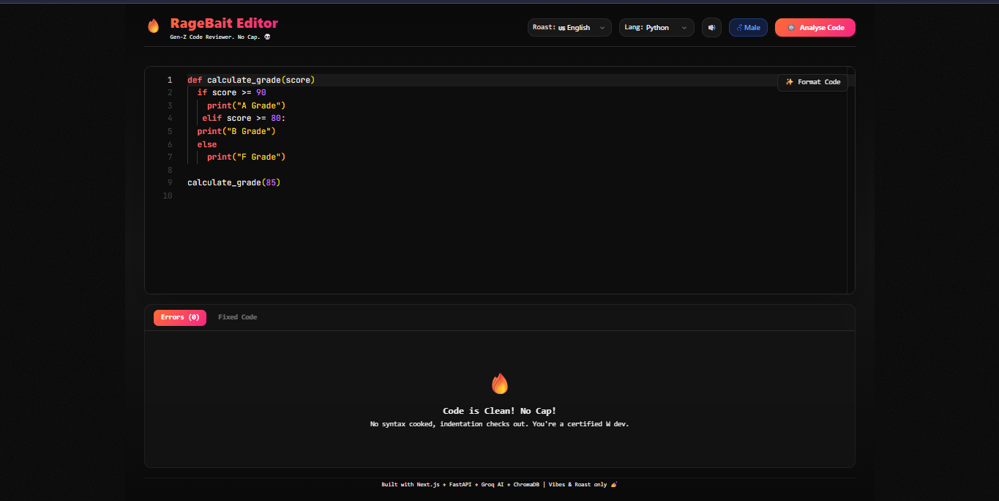
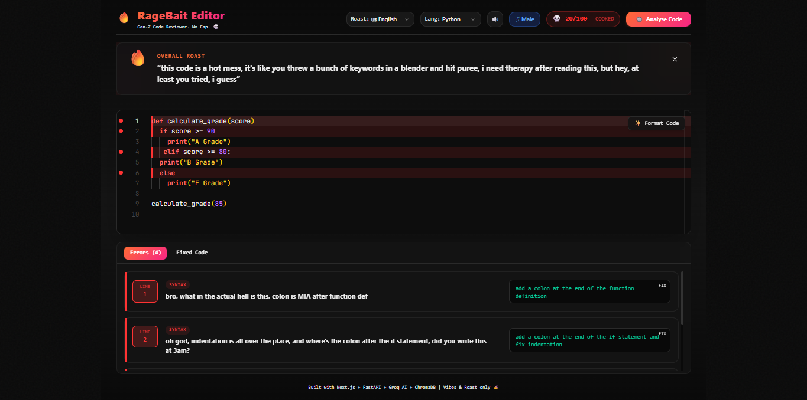

<div align="center">

# 🔥 RageBait Editor

### *The AI code reviewer that roasts you like your most savage best friend*

**Write code. Get destroyed. Copy the fix. Pretend it never happened. 💀**

[](https://ragebait-editor-delta.vercel.app)


</div>

---

## 📸 Screenshots

| Editor View | Roast in Action |
|---|---|
|  |  |

---

## 💀 What is RageBait Editor?

You write code → click **Analyse** → the AI finds every syntax error, indentation issue, logic flaw and wrong formatting → highlights the **exact lines** → and **absolutely destroys you** for each one in savage dark humour slangs.

It then **speaks the roast out loud** using Neural TTS voices in your chosen language.

No compiler. No execution. Pure AI humiliation.
Copy the fixed code. Paste in VS Code. Pretend you wrote it.

---

## ✨ Features

| Feature | Description |
|---|---|
| 🧠 AI Code Analysis | Groq Llama 3.3 70B generates original dark humour roasts every time |
| 🎯 Line Highlighting | Monaco Editor highlights exact error lines in red and yellow |
| 🗣️ Neural Voice Output | edge-tts speaks the roast out loud in real human voices |
| 🌍 Multi Language Roasting | English, Hinglish, Banglish, Bhojpuri, Marathi, Tamil, British |
| ♂️♀️ Voice Gender Toggle | Switch between Male and Female Neural voices |
| 💻 Universal Code Support | Python, JavaScript, TypeScript, Java, C++, Go, Rust and more |
| 🧬 RAG System | ChromaDB remembers past code patterns for smarter analysis |
| 📋 Fixed Code Tab | One click to copy the corrected code |
| 🏆 Score Badge | Code quality score out of 100 |
| 🥚 Easter Eggs | 8 hidden secrets scattered around the app |
| 🐳 Fully Dockerized | `docker compose up --build` and you're live |

---

## 🛠️ Tech Stack

```
Frontend    →  Next.js 14 + React + Tailwind CSS + Monaco Editor
Backend     →  FastAPI (Python)
AI Model    →  Groq — Llama 3.3 70B
Embeddings  →  sentence-transformers (all-MiniLM-L6-v2)
Vector DB   →  ChromaDB (local) / Supabase pgvector (cloud)
Voice       →  Microsoft edge-tts Neural TTS
Container   →  Docker + Docker Compose
Deploy      →  Vercel + Render + Supabase
```

---

## 🚀 Getting Started

### Prerequisites
- [Docker Desktop](https://www.docker.com/products/docker-desktop/)
- Groq API key — free at [console.groq.com](https://console.groq.com)

### Run Locally

```bash
# 1. Clone the repo
git clone https://github.com/shasradha/ragebait-editor.git
cd ragebait-editor

# 2. Create environment file
cp .env.example .env.local
# Add your GROQ_API_KEY inside .env.local

# 3. Run with Docker
docker compose up --build

# 4. Open the app
# Frontend  →  http://localhost:3000
# Backend   →  http://localhost:8000
# API Docs  →  http://localhost:8000/docs
```

> ⚠️ First startup takes ~2 minutes — sentence-transformers model downloads automatically. Subsequent starts are instant.

---

## ☁️ Cloud Deployment

| Service | Purpose | Cost |
|---|---|---|
| [Vercel](https://vercel.com) | Next.js Frontend | Free |
| [Render](https://render.com) | FastAPI Backend | Free |
| [Supabase](https://supabase.com) | pgvector Database | Free |

The codebase **auto-switches** between ChromaDB (local) and Supabase (cloud) based on the `VECTOR_BACKEND` env variable. No code changes needed.

---

## 📁 Project Structure

```
ragebait-editor/
├── frontend/
│   ├── app/page.tsx               # Main editor page
│   ├── components/
│   │   ├── Editor.tsx             # Monaco Editor
│   │   ├── ErrorPanel.tsx         # Error cards
│   │   └── RoastBanner.tsx        # Overall roast banner
│   └── lib/speech.ts              # edge-tts voice client
├── backend/
│   ├── routes/
│   │   ├── analyse.py             # Groq AI roasting
│   │   ├── speak.py               # Neural TTS voice
│   │   └── embed.py               # Code embedding
│   └── rag/
│       ├── vectorstore.py         # Smart env switcher
│       ├── vectorstore_chroma.py  # Local
│       └── vectorstore_supabase.py # Cloud
├── assets/                        # Screenshots
├── docker-compose.yml
└── .env.example
```

---

## 🥚 Easter Eggs

There are **8 hidden easter eggs** in the app.
We're not telling you what they are. Find them. 💀

---

## 🤝 Built By

<br>

<div align="center">
<table>
<tr>
<td align="center" width="50%">
<br><br>
<b>Shasradha Karmakar</b> &nbsp;<code>Yuvi</code><br><br>
AI · Backend · RAG · Voice · Frontend<br>
<i>AI & Cybersecurity Researcher · Independent Developer</i><br><br>
<a href="https://github.com/shasradha">GitHub</a> &nbsp;·&nbsp;
<a href="https://orcid.org/0009-0004-0597-9841">ORCID</a> &nbsp;·&nbsp;
<a href="https://shasradha.github.io">Portfolio</a>
</td>
<td align="center" width="50%">
<br><br>
<b>Pritish Karmakar</b> &nbsp;<code>Neil</code><br><br>
DevOps · Cloud Infrastructure · Docker · Deployment<br>
<i>CloudOps Engineer · Microsoft Azure · Terraform · Kubernetes</i><br><br>
<a href="https://github.com/Pritishkk">GitHub</a> &nbsp;·&nbsp;
<a href="https://linkedin.com/in/pritish-karmakar">LinkedIn</a>
</td>
</tr>
</table>
</div>

---

## 📄 License

This project is licensed under the **MIT License** — see the [LICENSE](LICENSE) file for details.

---

<div align="center">

## ⭐ Support

If this made you laugh or cry at your own code, drop a ⭐

It means a lot and helps others find the project!

**[github.com/shasradha/ragebait-editor](https://github.com/shasradha/ragebait-editor)**

*Built with Next.js + FastAPI + Groq + ChromaDB · Vibes & Roast only 🔥*

</div>
